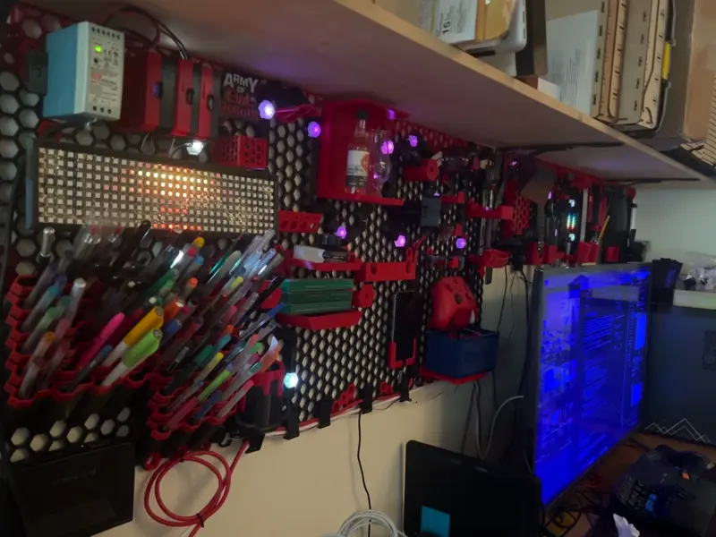

aoer-wled-doppler
=================

Now at 0.2.0!
-------------




WLED-doppler provides a `--user` system service which monitors the current time of day
and sets the dimming levels of WLED devices accordingly. It is location configured,
and automatically calculates sunrise/sunset. You can configure the time period over
which the dimming occurs (defaults to 20 minutes). Any WLED devices on the local 
network will be autodiscovered via mDNS, and sane defaults will be used for their
dimming settings. All you should need to do is set your lat/lon in the config, and
the service will do the rest.

There is also an optional audio monitoring subsystem which will look for output on
the configured audio device, and automatically pause/unpause LEDFX depending on
whether there is something playing. 

WLED-doppler can be installed via `cargo install --path .`

The configuration file will be autogenerated at startup if it does not yet exist.
Below is a simple guide to the settings:

```ron
(
    lat: 49.0,   // lat and
    lon: -124.0, // lon values for calculating sunset/sunrise.
    leds: { 
        // This is a totally new structure. It maps to the schedule to use
        // and then the min/max brightnesses for that WLED.
        "wled-derek-matrix-1._wled._tcp.local.":(
                schedule: ByName("matrix"),
                min_bri: 1,
                max_bri: 5,
            ),
        "wled-barback._wled._tcp.local.":(
                schedule: ByName("barback_schedule"),
                min_bri: 2,
                max_bri: 200,
            ),
        "wled-vu-strip._wled._tcp.local.":(
                schedule: Default,
                min_bri: 1,
                max_bri: 5,
            ),
        "wled-redshift-strip._wled._tcp.local.":(
                schedule: ByName("daylight"),
                min_bri: 30,
                max_bri: 150,
            ),
    },
    loglevel: 3,  // 0: no logging, 1: error, 2: warn, 3: info, 4: debug, 5: TRACE
    logfile: Some("/home/yourname/.wled-doppler/wled-doppler.log"),  // Where to log
    spotify_config: Some(SpotifyConfig(  // Currently not used.
            client_id: "SECRET ID",
            client_secret: "SECRET VALUE"
        )),
    audio_config: Some(AudioConfig(  // Optional audioconfig for monitoring.
            input_device: "default", //iec958:CARD=J380,DEV=0",
            jack: false,  // I've not tested jack integration. YMMV.
            ledfx_threshold_db: Some(-32.),  // How many db minimum to keep vis on.
        )),
    ledfx_url: Some("http://localhost:8888"), // If set to None, ledfx won't be modified.
    ledfx_idle_cycles: Some(5), // How many $CYCLE_SECONDS second cycles of silence before pausing ledfx 
    cycle_seconds: 10.0, // How many seconds between updates. Default 10.0 seconds
    schedule: {
        "matrix": [
            (
                time: Time("07:00:00"),
                change: Brightness(0.0),
            ),
            (
                time: Time("07:00:00"),
                change: Preset(2),  // Change to preset 2 at 7AM
            ),
            (
                time: Time("08:00:00"),
                change: Brightness(1.0),
            ),
            (
                time: Time("15:30:00"),
                change: Brightness(1.0),
            ),
            (
                time: Time("19:00:00"),
                change: Brightness(0.0),
            ),
            (
                time: Time("21:00:00"),
                change: Preset(1),  // Back to preset 1 at 9PM
            ),
        ],
        "daylight": [
            (
                time: Sunrise,  // Automatically calculated by lat/lon
                change: Brightness(0.0),
            ),
            (
                time: SunriseOffset(3600),  // Take an hour to smoothly transition
                change: Brightness(1.0),
            ),
            (
                time: Sunset,
                change: Brightness(1.0),
            ),
            (
                time: SunsetOffset(3600),  // Note that negative numbers are OK too.
                change: Brightness(0.0),
            ),
        ],
        "default": [
            (
                time: Time("07:00:00"),
                change: Brightness(0.0),
            ),
            (
                time: Time("08:00:00"),
                change: Brightness(1.0),
            ),
            (
                time: Time("15:30:00"),
                change: Brightness(1.0),
            ),
            (
                time: Time("19:00:00"),
                change: Brightness(0.0),
            ),
        ],
        "barback_schedule": [
            (
                time: Time("05:30:00"),
                change: Brightness(0.0),
            ),
            (
                time: Time("06:00:00"),
                change: Brightness(1.0),
            ),
            (
                time: Time("20:00:00"),
                change: Brightness(1.0),
            ),
            (
                time: Time("21:00:00"),
                change: Brightness(0.0),
            ),
        ],
    },
    restart_on_cfg_change: false // true -> Great if you're using systemd
)

```

SystemD
-------

To install as a SystemD service:

```bash
cp systemd/wled-doppler.service ~/.config/systemd/user/
systemctl --user enable wled-doppler
systemctl --user start wled-doppler
```

*Note:* There is some nominal multi-platform support in this codebase, but it has not been
tested outside of Linux (specifically Ubuntu/PopOS 22.04). I made this thing to scratch my
own itch, but it might be useful for other people with a little elbow grease.
Build automation is coming soon.
